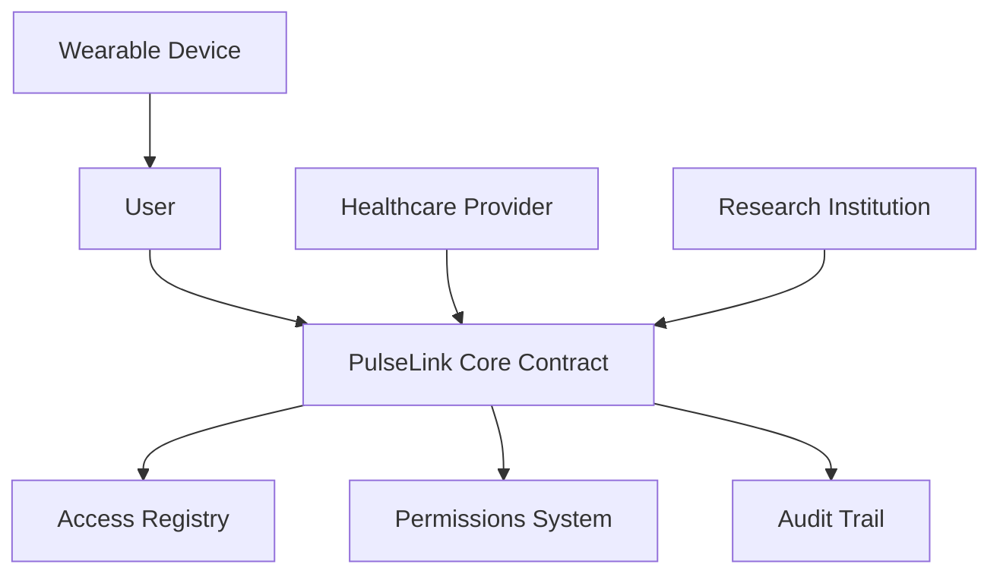

# Reserve Authenticator

A robust, blockchain-native access control and authentication system built on the Stacks blockchain.

## Overview

PulseLink Health Data Hub creates a secure platform where users can maintain ownership and control over their personal health data while selectively sharing it with healthcare providers, researchers, and fitness applications. Built on the Stacks blockchain, the system ensures data integrity and precise access control without storing sensitive health information on-chain.

### Key Features

- User-controlled data access permissions
- Secure device registration system
- Verified consumer authentication
- Comprehensive access audit trail
- Support for multiple health data types

## Architecture

The PulseLink system is built around a core smart contract that manages:
- User registration and authentication
- Device registration and management
- Access control and permissions
- Consumer verification
- Access history and auditing



## Contract Documentation

### PulseLink Core Contract

The main contract (`pulselink-core.clar`) handles all core functionality for the PulseLink system.

#### Data Types Supported
- Heart Rate
- Blood Pressure
- Sleep Data
- Activity Metrics
- Glucose Levels
- Oxygen Levels
- Temperature
- Weight

#### Key Components

1. **User Management**
   - User registration
   - Device registration and management
   
2. **Access Control**
   - Permission granting/revoking
   - Consumer verification
   - Access request handling

3. **Audit System**
   - Comprehensive access logging
   - Historical access tracking

## Getting Started

### Prerequisites
- Clarinet
- Stacks wallet
- Access to the Stacks blockchain

### Basic Usage

1. **Register as a User**
```clarity
(contract-call? .pulselink-core register-user)
```

2. **Register a Device**
```clarity
(contract-call? .pulselink-core register-device "device-123" "smartwatch")
```

3. **Grant Access to a Provider**
```clarity
(contract-call? .pulselink-core grant-data-access 
    'SP2JXKH6B14RMT7PP51439ZPWZQYNB3HB5J2289WB 
    "heart-rate" 
    (some u100000))
```

## Function Reference

### Public Functions

#### User Management
```clarity
(define-public (register-user))
(define-public (register-device (device-id (string-ascii 64)) (device-type (string-ascii 64))))
(define-public (remove-device (device-id (string-ascii 64))))
```

#### Access Control
```clarity
(define-public (grant-data-access (consumer principal) (data-type (string-ascii 64)) (expiry (optional uint))))
(define-public (revoke-data-access (consumer principal) (data-type (string-ascii 64))))
(define-public (request-data-access (user principal) (data-type (string-ascii 64)) (purpose (string-ascii 128))))
```

### Read-Only Functions
```clarity
(define-read-only (check-user-registration (user principal)))
(define-read-only (get-user-devices (user principal)))
(define-read-only (check-consumer-verification (consumer principal)))
(define-read-only (check-data-access (user principal) (consumer principal) (data-type (string-ascii 64))))
(define-read-only (get-access-details (access-id uint)))
```

## Development

### Testing
1. Clone the repository
2. Install Clarinet
3. Run tests:
```bash
clarinet test
```

### Local Development
1. Start Clarinet console:
```bash
clarinet console
```
2. Deploy contracts:
```clarity
(contract-call? .pulselink-core register-user)
```

## Security Considerations

### Data Privacy
- No actual health data is stored on-chain
- Only access permissions and audit logs are maintained on-chain
- All sensitive data should be stored off-chain with appropriate encryption

### Access Control
- Implement additional verification for consumer registration in production
- Regular audit of access logs
- Time-bound access permissions recommended
- Immediate access revocation available

### Best Practices
- Always verify consumer identity off-chain
- Regularly review and update access permissions
- Monitor access history for unauthorized attempts
- Use time-limited access grants when possible